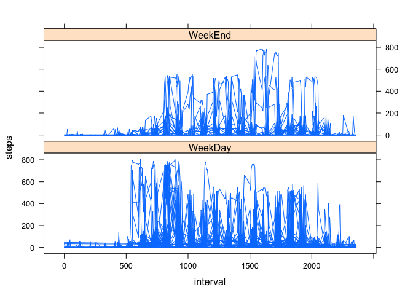

---
title: "Reproducibility Data Peer Assessment Project"
output: html_document
---  
   
  
###Loading and preprocessing the data

Student Name: Kannan Subbiah

Submission of Reproducible Data for processing the personal movement using activity monitoring devices for 5 minute intervals.  This markdown will demonstrate the strategy used to process the data as well as the actual results that can be reproduced using the same data used by my program.

-------------------------------------------


I loaded the data from the following website:

http://d396qusza40orc.cloudfront.net/repdata/data/  

File Name: activity.zip  
File: activity.csv  

File Link: [activity.zip](http://d396qusza40orc.cloudfront.net/repdata/data/activity.zip)  

The variables included in this dataset are:

    steps: Number of steps taking in a 5-minute interval (missing values are coded as NA)

    date: The date on which the measurement was taken in YYYY-MM-DD format

    interval: Identifier for the 5-minute interval in which measurement was taken

The dataset is stored in a comma-separated-value (CSV) file and there are a total of 17,568 observations in this dataset.  


Loading the neccessary library for processing the dataset.
Here we load dplyr, timeDate and lattice packages.
  

```r
library(dplyr)
library(timeDate)
library(lattice)
```

Now lets go ahead and load the data directly from the website.

*Here is the code to read the data* 

```r
# TempFile holds the zippped file activity.zip
TempFile <- tempfile()

# Download the csv file from the website
download.file("http://d396qusza40orc.cloudfront.net/repdata/data/activity.zip",TempFile, mode="wb")

# Reading the activity.csv from activity.zip stored in TempFile in to data frame Activity.
Activity <- read.csv(unz(TempFile, "activity.csv"))

# unlink deletes the TempFile contents
unlink(TempFile)

#summary(Activity)
```


###Calculate the Mean total number of steps taken per day.

The next step is to process the data to find the Mean and Median of the dataset.

*Here is the code that measures the mean for the steps taken per day.*

```r
MeanSteps <- mean(Activity$steps, na.rm = TRUE)
MedianSteps <- median(Activity$steps, na.rm = TRUE)
```

The mean total number of steps taken per day is **37.3825996** 

The median total number of steps taken per day is **0**   


###Histogram of the total number of steps taken each day

Next step is to plot a histogram of the dataset's steps taken values.

*Code to create a histogram:*

```r
hist(Activity$steps, xlab="Steps", main="Histogram of Total Number of Steps taken each day")
```

 

###Average Daily Activity Pattern

Time Series Plot  of the total number of steps taken each day

*Code to create the time series plot with Date on X Axis and Steps on Y Axis.*

```r
# Remove all NA values from column "steps" and store in a dataframe ActivityNoNA
ActivityNoNA <- Activity[complete.cases(Activity),]

# Calculate the Average steps per interval,  group by interval and summarise it based on intervals 
# and store it on to dataframe AvgIntervalPattern
AvgIntervalPattern <- ActivityNoNA %>%
  group_by(interval) %>%
  summarise(IntervalMean = mean(steps))

# Create a time seris plot with date versus Daily Mean of steps per day, using type as "l" for lineplot
plot(AvgIntervalPattern$interval, AvgIntervalPattern$IntervalMean, type="l", xlab = "Interval", ylab="Average Steps")
```

 

Now we calculate which Interval contains the maximum numbers of steps

*Here is the code to pick the Interval which has maximum average daily steps.*

```r
# Calculate the Maximum number of average steps registered per 5 minute interval
MaxSteps <- max(AvgIntervalPattern$IntervalMean)

# Find out which 5 minute interval has the maximum number of steps registered
# and store it as a character string in MaxStepsInterval
MaxStepsInterval <- as.character(AvgIntervalPattern$interval[which(AvgIntervalPattern$IntervalMean == MaxSteps)])
```

5 Minute Interval# **835** contains the maximum average number of steps which is **206.1698113.**  


Now we calculate the total number of rows that has NA in "steps" column.

*Here is the code to find the NA values in the dataset.

```r
# Calculate the Total number of NA by subtracting the complete cases from total rows
TotalNA <-  nrow(Activity) - sum(complete.cases(Activity))
```

The record set has **2304** number of rows that has missing values : NA

Current Activity dataframe contains the following data


```r
head(Activity)
```

```
##   steps       date interval
## 1    NA 2012-10-01        0
## 2    NA 2012-10-01        5
## 3    NA 2012-10-01       10
## 4    NA 2012-10-01       15
## 5    NA 2012-10-01       20
## 6    NA 2012-10-01       25
```


Now that we know how many NAs are there in the dataset, we need to fix the NA rows.
First lets copy Activity dataframe to Activity2 and add a new column called "Avg"
Fill in the Avg value with the 5 minute interval average value that we calculated above
in the dataframe AvgIntervalPattern

Lets look at the AvgIntervalPattern dataframe
It contains the 5 minute interval average for all days in column IntervalMean.

```r
head(AvgIntervalPattern)
```

```
## Source: local data frame [6 x 2]
## 
##   interval IntervalMean
## 1        0    1.7169811
## 2        5    0.3396226
## 3       10    0.1320755
## 4       15    0.1509434
## 5       20    0.0754717
## 6       25    2.0943396
```

Lets add IntervalMean column to Activity2 and copy data from AvgIntervalPattern's IntervalMean
data to Activity2 dataframe.

*Here is the code to do that step*

```r
Activity2 <- Activity
Activity2$Avg <- AvgIntervalPattern$IntervalMean

head(Activity2)
```

```
##   steps       date interval       Avg
## 1    NA 2012-10-01        0 1.7169811
## 2    NA 2012-10-01        5 0.3396226
## 3    NA 2012-10-01       10 0.1320755
## 4    NA 2012-10-01       15 0.1509434
## 5    NA 2012-10-01       20 0.0754717
## 6    NA 2012-10-01       25 2.0943396
```

```r
tail(Activity2)
```

```
##       steps       date interval       Avg
## 17563    NA 2012-11-30     2330 2.6037736
## 17564    NA 2012-11-30     2335 4.6981132
## 17565    NA 2012-11-30     2340 3.3018868
## 17566    NA 2012-11-30     2345 0.6415094
## 17567    NA 2012-11-30     2350 0.2264151
## 17568    NA 2012-11-30     2355 1.0754717
```

We got the average 5 minute interval added to all days
To fix the NA values with 5 minute interval values, 
Lets get the row number of all "steps" that has NA


```r
NARows <- which(is.na(Activity$steps) == TRUE)
length(NARows)
```

```
## [1] 2304
```

```r
head(NARows)
```

```
## [1] 1 2 3 4 5 6
```

Now that we got all the row numbers in NARows, lets go ahead and replace
any "steps" row that has "NA" with the value in "Avg" row


```r
Activity2$steps[NARows] <- Activity2$Avg[NARows]
head(Activity2)
```

```
##       steps       date interval       Avg
## 1 1.7169811 2012-10-01        0 1.7169811
## 2 0.3396226 2012-10-01        5 0.3396226
## 3 0.1320755 2012-10-01       10 0.1320755
## 4 0.1509434 2012-10-01       15 0.1509434
## 5 0.0754717 2012-10-01       20 0.0754717
## 6 2.0943396 2012-10-01       25 2.0943396
```

```r
tail(Activity2)
```

```
##           steps       date interval       Avg
## 17563 2.6037736 2012-11-30     2330 2.6037736
## 17564 4.6981132 2012-11-30     2335 4.6981132
## 17565 3.3018868 2012-11-30     2340 3.3018868
## 17566 0.6415094 2012-11-30     2345 0.6415094
## 17567 0.2264151 2012-11-30     2350 0.2264151
## 17568 1.0754717 2012-11-30     2355 1.0754717
```

Compare the above values with the Activity values.

```r
head(Activity) 
```

```
##   steps       date interval
## 1    NA 2012-10-01        0
## 2    NA 2012-10-01        5
## 3    NA 2012-10-01       10
## 4    NA 2012-10-01       15
## 5    NA 2012-10-01       20
## 6    NA 2012-10-01       25
```

```r
tail(Activity) 
```

```
##       steps       date interval
## 17563    NA 2012-11-30     2330
## 17564    NA 2012-11-30     2335
## 17565    NA 2012-11-30     2340
## 17566    NA 2012-11-30     2345
## 17567    NA 2012-11-30     2350
## 17568    NA 2012-11-30     2355
```

Now that we fixed all NA, we dont need the Avg column in Activity2. Lets remove it.

```r
Activity2$Avg <- NULL 
```

###Histogram of the total number of steps taken each day from the new dataset.

*Code to create a histogram:*

```r
hist(Activity2$steps, xlab="Steps", main="Histogram of Total Number of Steps taken each day - No NA")
```

 


###Calculate the Mean total number of steps taken per day on the new dataset Activity2.

*Here is the code that measures the mean for the steps taken per day.*

```r
NewMeanSteps <- mean(Activity2$steps)
NewMedianSteps <- median(Activity2$steps)
```

After fixing NA, the mean total number of steps taken per day is **37.3825996** 

Mean total number of steps with NA is **37.3825996**

```
## By fixing the NA with average values, there is no big difference in Mean at all!
```

After fixing NA, the median total number of steps taken per day is **0**   

Median total number of steps with NA is **0**

```
## By fixing the NA with average values, there is no big difference in Median value at all!
```

Add a new factor column called **Day** to Activity2.
If the date falls in a WeekDay, then make Day as "WeekDay" else, make it "WeekEnd"


```r
Activity2$Day <- isWeekday(Activity2$date)
Activity2$Day[Activity2$Day == TRUE] <- c("WeekDay")
Activity2$Day[Activity2$Day == FALSE] <- c("WeekEnd")
```

Now, lets create a Panel Plot using lattice
*Here is the code to draw the panel plot:*

```r
xyplot(steps ~ interval | Day , data = Activity2, layout = c(1,2), type="l")
```

 

The entire R markdown can be run from knitr and the exact above results can be obtained or reproduced, unless the original dataset from the website changes.

